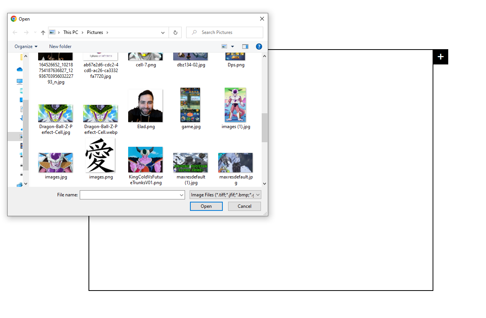

# Move on click images
### In this app you can add images to the game board and move them around, you can't go past another image or go off board.

### It is a very simple app with only HTML+CSS+JavaScript.

## features
* All images are "solid" 2d objects and you can't move an image via another image.
* The border is also a border(yes!😂) you cant go off borders.
* If there are too many images and there is no more space the game will alert you so when trying to add an image.
* Auto-focus on the newly added image.
* focus images will have a border so you know what image you pressed on last.

## Prerequisites
* Download/clone this repository.
* Web browser

 

# Screenshots:
 

 

 

 

In order to run the app you can use Live server or open the HTML file 

 

# Summary
This is a simple game like app made mostly for practice, it only uses JavaScript and does not contain any external packages

 

### `Feel free to contact me`:

